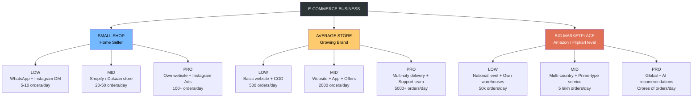

# Small, Average, and Big E-Commerce Networks — Explained Simply

> Here **"network"** does **not** mean cables, Wi-Fi, routers, or switches.
> Here **"network"** means the **size and reach of an e-commerce business** — how many customers it has, how many orders it handles, and how big its selling system is.

Think of it like this:
- A **small network** = a small shop that sells to a few people.
- An **average network** = a growing brand that sells to thousands.
- A **big network** = a giant marketplace that sells to crores of people.

---

## 1. Small E-Commerce Network — "The Home Seller"

### Real-life example:
Imagine **Ramesh Bhai** who sells handmade sarees from his home.
- He posts photos on **WhatsApp status and Instagram**.
- 5–10 friends or neighbors order every day.
- He packs the orders himself and gives them to the courier boy.
- Payment comes through **UPI or Cash on Delivery**.

### What does this business look like?
- **Very few customers** — mostly known people, friends, or local buyers.
- **No website needed** — selling happens on chat apps.
- **One person handles everything** — taking orders, packing, replying to messages.
- **Low investment** — no office, no staff, no warehouse.

### Where you see it:
- Home bakers
- Hand-made jewellery sellers on Instagram
- Small tailors selling on WhatsApp
- A person selling homemade pickles in their society

### Simple truth:
> **Small e-commerce network = a roadside shop, but online. One person, few customers, simple selling.**

---

## 2. Average E-Commerce Network — "The Growing Brand"

### Real-life example:
Imagine a brand called **FashionHub** that sells trendy clothes online.
- They have **their own website** — fashionhub.in.
- They also have a **mobile app**.
- They get **500 to 5000 orders every day**.
- They have a **small office with 30–50 employees** — designers, customer care, packers.
- They deliver to **many cities across India**.
- They run **ads on Instagram and Google**.

### What does this business look like?
- **Thousands of customers** across many cities.
- **Proper online store** with categories, search, filters, reviews.
- **A team of people** doing different jobs.
- **A warehouse** to store products.
- **Customer support** through phone, chat, email.
- **Discounts, coupons, offers** to attract buyers.

### Where you see it:
- Brands like Bewakoof, Sugar, Mamaearth (in their early/growing days)
- Local D2C brands (direct-to-customer)
- Mid-size clothing, cosmetics, or food brands

### Simple truth:
> **Average e-commerce network = a branded shop in a mall. Many customers, proper team, good setup.**

---

## 3. Big E-Commerce Network — "The Giant Marketplace"

### Real-life example:
Think of **Amazon** or **Flipkart**.
- **Crores of customers** across the whole country (and world).
- **Lakhs of sellers** listed on one platform.
- **Lakhs of products** in every category — mobile, clothes, grocery, books.
- **Many warehouses** in different cities.
- During **Big Billion Day / Great Indian Sale**, they sell **crores of rupees worth of products in one day**.
- **Lakhs of employees** worldwide.

### What does this business look like?
- **Global or national reach** — anyone, anywhere can order.
- **Huge product catalog** — almost anything you can think of is available.
- **Fast delivery** — same day or next day in many cities.
- **Multiple apps and websites** — shopping, groceries, videos, music.
- **AI-based suggestions** — "You may also like…", personalized ads.
- **Big advertising budget** — TV, YouTube, newspapers, cricket sponsorships.

### Where you see it:
- Amazon, Flipkart, Myntra, Meesho, Nykaa, Ajio
- Alibaba (China), eBay (USA)
- Zomato, Swiggy (in food), BigBasket (in grocery)

### Simple truth:
> **Big e-commerce network = a giant city mall + supermarket + delivery empire, all online.**

---

## Quick Side-by-Side Comparison

| Thing | Small (Home Seller) | Average (Growing Brand) | Big (Giant Marketplace) |
|---|---|---|---|
| **Customers** | Few friends & locals | Thousands in many cities | Crores across country/world |
| **Orders per day** | 5 – 20 | 500 – 5,000 | Lakhs to crores |
| **Where they sell** | WhatsApp, Instagram | Own website + app | Own huge platform |
| **Team size** | 1 (themself) | 30 – 100 | Lakhs of employees |
| **Warehouse** | Their room | 1 small godown | Many huge warehouses |
| **Delivery area** | Same city | Many cities | Whole country / world |
| **Advertising** | WhatsApp status | Instagram & Google ads | TV, IPL, YouTube, everywhere |
| **Example** | Home baker, saree seller | Bewakoof, Sugar, BoAt | Amazon, Flipkart, Myntra |

---

## Even Simpler — In One Line Each

- **Small Network** = Your **neighbor who sells homemade cakes on WhatsApp**.
- **Average Network** = A **known clothing brand with its own website and app**.
- **Big Network** = **Amazon** — where the whole country shops everyday.

---

## Hierarchy Diagram — E-Commerce Business Packages

Each business size comes in **3 packages**:
- **Low** → Just starting out. Minimum setup to open shop.
- **Mid** → Growing business. More features, more customers.
- **Pro** → Fully loaded. Ready for big rush and serious growth.

---

### Tree View (Simple)

```
                        ┌──────────────────────────┐
                        │   E-COMMERCE BUSINESS    │
                        └─────────────┬────────────┘
                                      │
          ┌───────────────────────────┼───────────────────────────┐
          │                           │                           │
  ┌───────▼────────┐         ┌────────▼────────┐         ┌────────▼────────┐
  │  SMALL SHOP    │         │  AVERAGE STORE  │         │  BIG MARKETPLACE│
  │ (Home Seller)  │         │ (Growing Brand) │         │  (Amazon-like)  │
  └───────┬────────┘         └────────┬────────┘         └────────┬────────┘
          │                           │                           │
    ┌─────┼─────┐               ┌─────┼─────┐               ┌─────┼─────┐
    │     │     │               │     │     │               │     │     │
  ┌─▼─┐ ┌─▼─┐ ┌─▼─┐           ┌─▼─┐ ┌─▼─┐ ┌─▼─┐           ┌─▼─┐ ┌─▼─┐ ┌─▼─┐
  │LOW│ │MID│ │PRO│           │LOW│ │MID│ │PRO│           │LOW│ │MID│ │PRO│
  └───┘ └───┘ └───┘           └───┘ └───┘ └───┘           └───┘ └───┘ └───┘
```

---

### Mermaid Diagram (renders as a real chart)



---

### Package Details for Each Business Size

#### 🏠 SMALL SHOP (Home Seller / Solo Business)

| Package | What You Get | Real Example | Monthly Revenue |
|---|---|---|---|
| **LOW** | Sells on WhatsApp & Instagram DMs, payment via UPI, self-delivered | Ramesh Bhai selling sarees from home | ₹10,000 – ₹50,000 |
| **MID** | Simple online store (Shopify / Dukaan / Meesho), online payment, courier pickup | Home baker with a Shopify store | ₹50,000 – ₹2 lakh |
| **PRO** | Own branded website, Instagram/Facebook ads, 1–2 helpers, proper packaging | Boutique brand with loyal customers | ₹2 – 10 lakh |

---

#### 🏘️ AVERAGE STORE (Growing E-Commerce Brand)

| Package | What You Get | Real Example | Monthly Revenue |
|---|---|---|---|
| **LOW** | Basic website, COD + online pay, 1 warehouse, 5–10 staff | A new clothing brand selling in 1–2 cities | ₹10 – 50 lakh |
| **MID** | Website + mobile app, discounts & offers, delivery in many cities, 30–50 staff | Mid-tier brands like Bewakoof, Zivame (early stage) | ₹1 – 10 crore |
| **PRO** | Fully featured store, 24x7 customer care, multiple warehouses, 100+ staff | FashionHub, BoAt, Mamaearth (growing phase) | ₹10 – 50 crore |

---

#### 🏙️ BIG MARKETPLACE (Enterprise E-Commerce)

| Package | What You Get | Real Example | Monthly Revenue |
|---|---|---|---|
| **LOW** | National reach, own warehouses in many states, lakhs of products | Nykaa, Ajio | ₹100 – 500 crore |
| **MID** | Multi-country, fast delivery (Prime-type), many sellers, app + web | Flipkart, Myntra | ₹500 – 5,000 crore |
| **PRO** | Global presence, AI-based recommendations, 1-day delivery, crores of products | Amazon, Alibaba | ₹10,000+ crore |

---

### Simple Story to Remember

Think of it like **running a food business**:

- **SMALL SHOP = Home Tiffin Service**
  - *Low* = Sending tiffins to 5 neighbors via WhatsApp
  - *Mid* = Small Zomato-listed home kitchen
  - *Pro* = Branded "Cloud Kitchen" with ads and delivery partners

- **AVERAGE STORE = Restaurant Chain**
  - *Low* = 1 restaurant in one city
  - *Mid* = 5–10 restaurants across the state
  - *Pro* = 50+ restaurants with own delivery fleet

- **BIG MARKETPLACE = Food Delivery Giant**
  - *Low* = Zomato when it started
  - *Mid* = Today's Zomato / Swiggy
  - *Pro* = Global giants like Uber Eats, DoorDash

As you go from **Low → Mid → Pro**, you get:
- More **customers**
- More **orders**
- More **features** (app, offers, fast delivery)
- More **staff & systems**
- More **money earned** — and also **more money spent**

---

## Why Does This Matter?

Because the **bigger the e-commerce network**, the **more things** you need to take care of:
- More customers to serve
- More money to run it
- More staff to manage
- More technology to support it

Just like running a **tea stall**, a **café chain**, and a **whole 5-star hotel group** — the idea is the same (selling food and drinks), but the size and effort are very different.

---

*Made simple so that even someone who has never touched a computer or run a business can understand it.*
